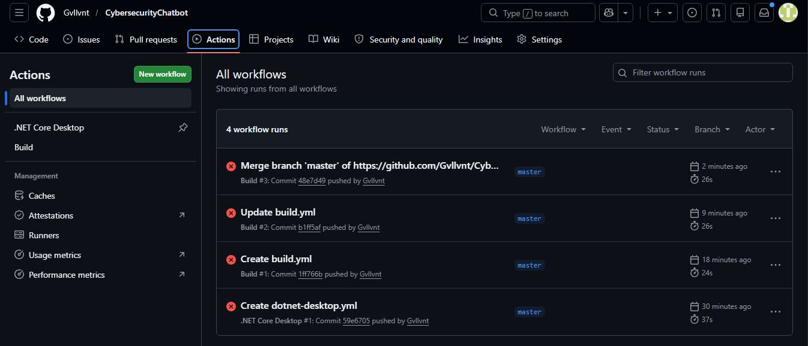

# 🔒 Cybersecurity Awareness Bot

A command-line chatbot for South African citizens to learn about online safety, phishing, password security, and safe browsing.

## 📋 Features
- 🎤 Voice greeting at startup
- 🎨 ASCII art logo display
- 💬 Personalized conversation using user's name
- 🔐 Cybersecurity tips and advice
- ✅ Input validation for empty entries
- 🎨 Colored console UI with typing effect

## 🛠️ Technologies Used
- C# .NET Framework 4.8
- Visual Studio 2022
- GitHub Actions (CI)

## 📸 CI Workflow Attempt

*NB: CI workflow shows my build attempts.But the project builds successfully on local Visual Studio 2022.*

## 👨‍💻 Author
Thamanda Sobekwa

## 📅 Course
Diploma in Software Development- Programming 2A